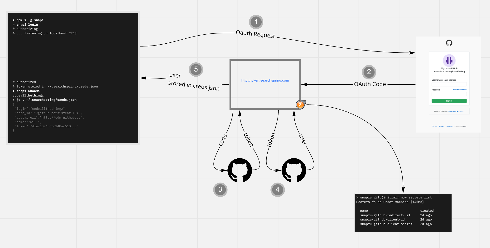

# Snapfu

The scaffolding CLI for the Snap SKD.

## Development Prerequisites

- node
- golang
- install the project in your workspace directory
    - `git clone git@github.com:searchspring/snapfu.git`
    - `cd snapfu && npm i`
- install the token exchange project in your workspace directory
    - `git clone git@github.com:searchspring/github-token-exchange.git`
    - `cd github-token-exchange && go get -u`

## Development

Run the token exchange server

```bash
cd github-token-exchange
make run
```

Run the snapfu client

```bash
cd snapfu
snapfu login --dev
snapfu init --dev
```

## Misc
 
Format the code

`npm run format`

## Architecture


Open in <a href="https://miro.com/app/board/o9J_km-MoYk=/?moveToWidget=3074457349590531586&cot=12">Miro</a>
